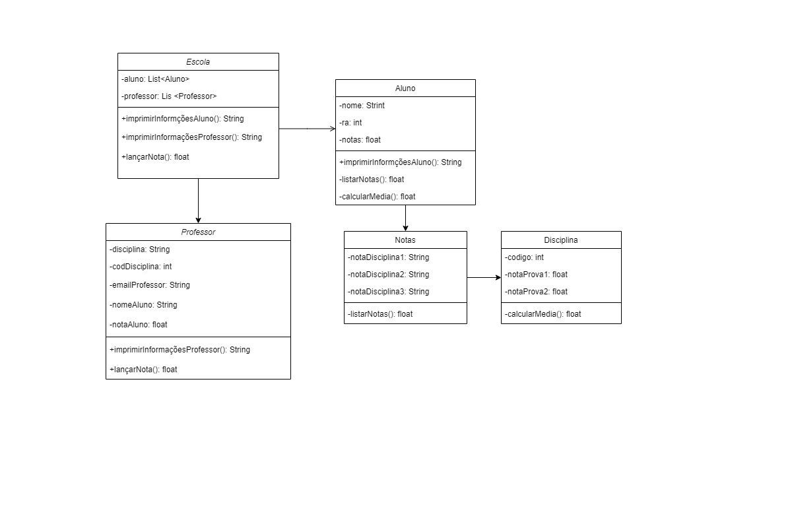
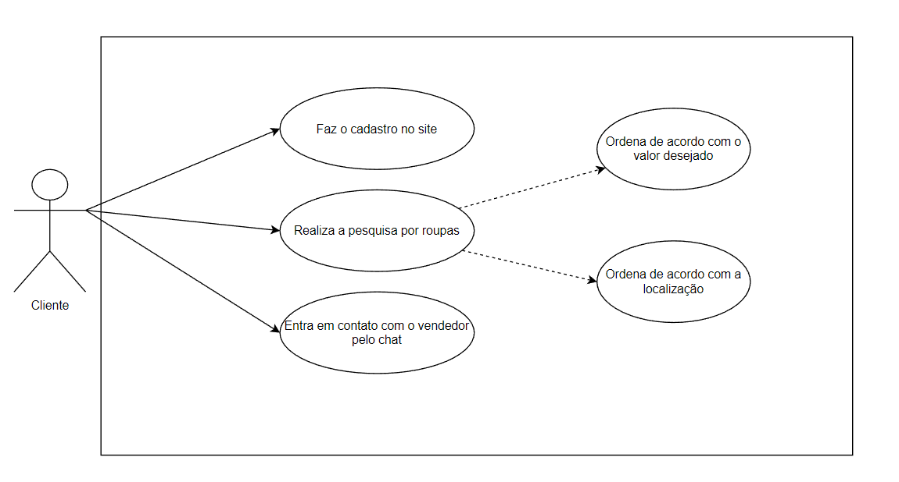

## 18/08/2022-Engenheiro de software
"We see three critical differences between programming and software engineering: time, scale, and the trade-offs at play. On a software engineering project, engineers need to be more concerned with the passage of time and the eventual need for change. In a software engineering organization, we need to be more concerned about scale and efficiency, both for the software we produce as well as for the organization that is producing it. Finally, as software engineers, we are asked to make more complex decisions with higher-stakes outcomes, often based on imprecise estimates of time and growth. Within Google, we sometimes say, “Software engineering is programming integrated over time.” Programming is certainly a significant part of software engineering: after all, programming is how you generate new software in the first place. If you accept this distinction, it also becomes clear that we might need to delineate between programming tasks (development) and software engineering tasks (development, modification, maintenance). The addition of time adds an important new dimension to programming. Cubes aren’t squares, distance isn’t velocity. Software engineering isn’t programming."

Titus Winters, Software Engineering at Google

<h4>Comentário: </h4>
Embora um engenherio de software possa ser considerado um desenvolvedor de software, as suas responsabilidades vão além do código. Sendo assim, ela está altamente conectada com gerenciamento do tempo, planejamento e as mudanças que podem ocorrer ao longo do projeto.  
 
## 19/08/2022 - Trade-off no API
O trade off pode ser descrito como as decisões necessárias que uma pessoa tem que tomar para realizar determinadas ações, entretanto, não existe uma decisão ruim, mas sim a melhor decisão para a ação que precisa ser tomada para que traga os melhores resultados. Partindo desse princípio, quando tratamos do trade off no API, estamos nos referindo a melhor decisão para realizar o projeto, um exemplo claro disso foi na escolha da melhor plataforma para realizar o wireframe do projeto, na qual foi escolhida aquela que nos traria melhores resultados.

## 25/08/2022 - Atividade de requisitos
<h3>Requisitos Funcionais e Não-Funcionais de aplicativo para notas escolares: </h3>
 
<h4>Funcionais:</h4> 
- O professor pode realizar o cadastro dos alunos, com nome, número do Registro Acadêmico e Email. 
- O professor pode lançar a nota dos alunos no sistema. 
- O professor pode realizar o seu cadastro, com nome, nome da disciplina e Email.  
 
<h4>Não funcionais:</h4> 
- Facilidade do professor para publicar as notas do seu aluno.  
- Facilidade do aluno para visualizar as suas notas no sistema.  
- Plataforma rápida e intuitiva.  

## 01/09/2022 - Atividade Diagrama de Classes
<h3>Diagrama de classes de aplicativo para compras de roupas: </h3>

## 22/09/2022 - Diagrama de Casos de Uso
 

