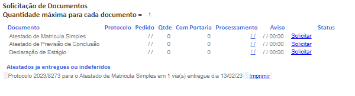
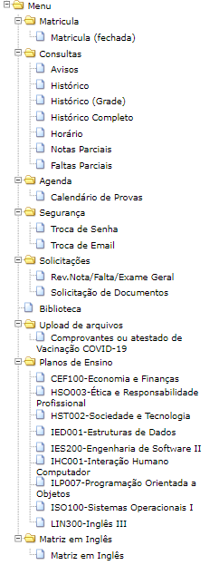
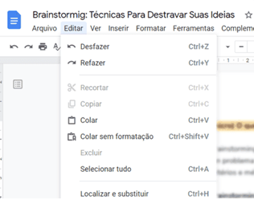
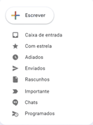
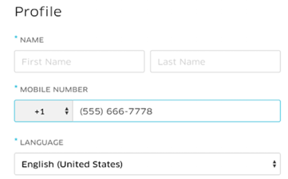
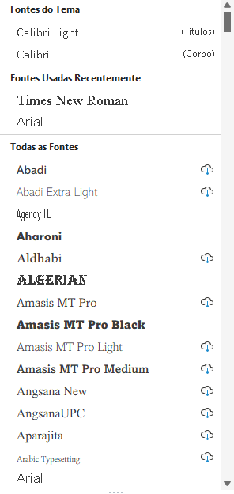
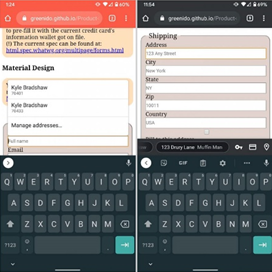
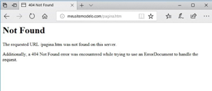
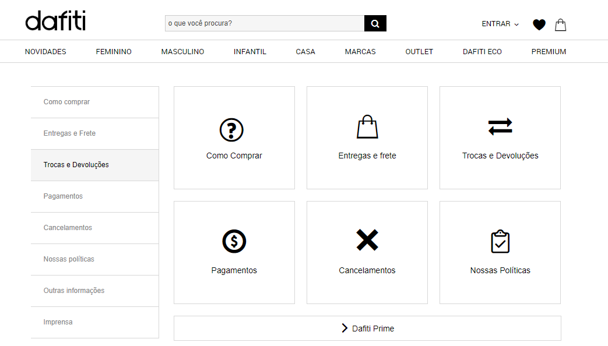

# Avaliação Heurística GUI - Aplicação

<h3>1 - Visibilidade do status: </h3>

Essa heurística é importantíssima, pois, ao interagirmos com a interface normalmente estamos envolvidos com diversos processos, por esse motivo é importante que o usuário saiba em que nível ele se encontra, quantos passos faltam para que ele conclua seu processo e que esse feedback seja feito em tempo instantâneo.

O Youtube, por exemplo, disponibiliza uma barra lateral informando qual vídeo estamos vendo, quais já foram assistidos e quais são os próximos da lista.

Já o site do SIGA ao solicitar um documento, quando clica-se em "solicitar" o pedido é enviado, porém não é
retornado nenhum aviso que a solicitação foi feita, assim como o retorno do documento que não existe aviso prévio.

 
 

<h3>2 - Correspondência entre o sistema e o mundo real: </h3>

Reconhecer objetos e ícones que nos são familiares objetivo reduz nossa carga cognitiva. A segunda heurística de Nielsen diz respeito a criar uma interface funcional e acessível que fale a linguagem do usuário. Ou seja, que utiliza palavras, frases e conceitos que sejam familiares a ele. Para estabelecer essa comunicação, é possível utilizar ícones, por exemplo, que representam uma determinada ação. Como o símbolo de telefone nos smartphones que significa, geralmente, fazer ligações.

O SIGA entra como problema nessa heurística também, pois utiliza apenas de textos, não faz o uso de imagens
visuais que possam facilitar a interação do usuário com a interface

 
 

<h3>3 - Liberdade e controle do usuário:</h3>

Nunca se deve impor uma ação ao usuário ou tomar decisões por ele. Pelo contrário, deve-se apenas saber sugerir as ações sem pressionar ou induzi-lo a algo. É muito importante que o usuário tenha liberdade e possa decidir e tomar as ações que quiser — exceto quando existem regras que vão contra o sistema ou interferem em alguma funcionalidade. No entanto, é preciso levar em consideração que o usuário pode tomar uma ação errada ou se arrepender da decisão que tomou, por isso, é necessário pensar em funções como fazer e desfazer para que o usuário consiga desfazer e refazer suas ações conforme suas necessidades.

 

<h3>4 - Consistência e padrões:</h3>

Essa heurística diz respeito a manter uma mesma linguagem durante toda a interface para não confundir o usuário. Nesse sentido, durante a interação, os usuários não devem ter dúvidas sobre o significado das palavras, ícones ou símbolos utilizados. Portanto, é fundamental que uma interface siga as convenções da plataforma, mantendo padrões de interação em diversos e diferenciados contextos. É necessário que a interface fale a mesma língua o tempo todo e trate coisas similares da mesma maneira. Assim, facilitará que o usuário identifique o padrão existente naquela interface.

 

<h3>5 - Prevenção de Erros:</h3>

Essa heurística de Nielsen propõe que a interface esteja apta a prevenir qualquer tipo de ação descuidada do usuário. É bom prevenir que o usuário se frustre ao ter os arquivos deletados, ou colocar uma formatação que não é especificada no site, é importante criar uma mensagem de aviso da ação, para que haja a confirmação ou não da decisão.

 

A Uber.com exibe automaticamente o número de telefone no formato desejado conforme os usuários digitam, para que eles possam digitalizar mais facilmente seu trabalho para confirmar se está correto. Quando não é fornecido um feedback claro quando o usuário faz algo errado é um erro exorbitante, o que causará frustação no usuário e confusão.

<h3>6 - Reconhecer ao invés de lembrar:</h3>

É importante pensar em maneiras de deixar ícones e elementos de ação sempre visíveis e que as informações estejam presentes de forma fácil. Nós temos a tendência de ter mais facilidade em reconhecer do que lembrar de algo.
O usuário não deve ter que se lembrar de todas as ações ou funções da interface. Portanto, é importante sempre deixar à disposição pequenos lembretes das informações que podem ser úteis a ele. 

 

Um exemplo é o Word, ele deixa especificado cada uma das fontes que o usuários pode utilizar.

Essa heurística é muito importante na questão de evitar que o usuário tenha que memorizar informações que ele deveria ser capaz de encontrar facilmente no site, o que pode levar à perda de tempo.

<h3>7 - Eficiência e flexibilidade:</h3>

A interface desenvolvida precisa ser útil e atender tanto aos usuários inexperientes quanto aos experientes. Os inexperientes precisam de informações mais detalhadas. Mas conforme eles vão se aprimorando com o uso da interface, passam a utilizá-la de forma mais customizada, por exemplo, criando atalhos de teclado.

Desse modo, é fundamental permitir que os usuários da interface personalizem ações frequentes, como atalhos de teclados e preenchimento automático de dados. Isso aprimora a eficiência e flexibilidade de uma interface.

No exemplo abaixo podemos observar o preenchimento automático do Google Chrome para celulares Android.

 

<h3>8 - Estética e design minimalista:</h3>

O Designer Visual deve criar diálogos que contenham somente informações relevantes. Ou seja, evitar o uso desnecessário de elementos visuais que possam confundir o usuário. Cada informação extra compete com uma unidade de informação relevante e acaba por diminuir sua visibilidade.

O site da aela possui um designer limpo e minimalista, sem informações em excesso que possam confundir o usuário.

 

<h3>9 - Ajude o usuário a reconhecer, diagnosticar e recuperar erros:</h3>

A prevenção de erros do usuário é algo bastante importante dentro de uma interface. No entanto, mais importante ainda é ajudar o usuário a identificar e encontrar soluções para os problemas e erros encontrados durante a interação.

As mensagens de erro devem ser expressas em uma linguagem simples; sem códigos, clara e que indique precisamente o problema e sugira uma solução.

 

No exemplo acima temos o exemplo de página não encontrada, porém para alguns usuários mais leigos isso pode não ajudar, já que as informações estão em inglês, o que torna difícil para muitos deles reconhecer o erro de uma maneira melhor.

<h3>10 - Ajuda e documentação:</h3>

A última das heurísticas de Nielsen diz respeito a inclusão de itens de auxílio para o usuário. Apesar de todas as heurísticas listadas ajudarem a evitar erros e solicitação de ajuda por parte do usuário, é importante pensar em maneiras de auxiliá-lo a qualquer momento de sua interação.

Uma solução bem frequente nas interfaces são os FAQs, nos quais são compiladas as principais e mais frequentes dúvidas e suas respectivas soluções.

 

No exemplo acima, no site da Dafiti, por exemplo, tem um FAQ que permite aos usuários verem as dúvidas mais frequentes e suas respectivas soluções, podendo assim resolver por conta um problema que esteja aqui.

É importante que a interface não forneça muitas informações na área de documentação e ajuda, pois isso poderia tornar a experiência do usuário maçante.

